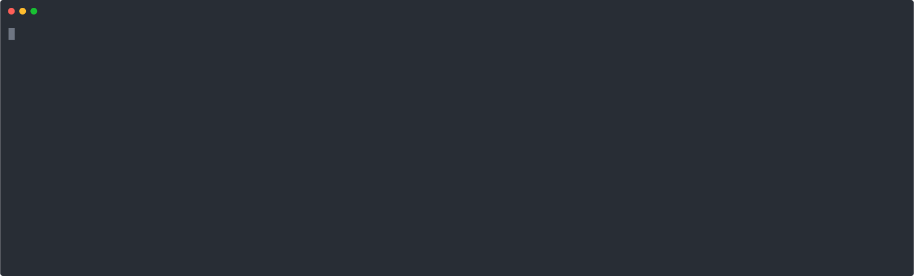
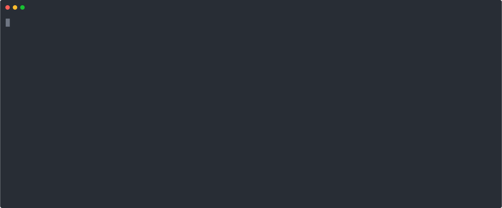

[](https://circleci.com/gh/toptal/codeowners-checker)

# Codeowners Checker

This gem checks if the GitHub codeowners are specified to all files changes
between two git revisions.

## Installation

    $ gem install codeowners-checker

## Usage

### Configure

    $  codeowners-checker config owner <@owner>

It will configure `@owner` as the default owner in the config file.


### Fetching and validating owners

By default, [check](#check-file-consistency) command wil validate owners either against prepopulated file (OWNERS)
or against data fetched from github.
Format of OWNERS is one owner per line.

Example OWNERS:
```
@company/backend-devs
@company/frontend-devs
@john.smith
```
Github credentials are taken from the following environment variables. You might want to put them into your .bashrc or equivalent:

    $ export GITHUB_TOKEN='your github PAT' # your personal access token from github
    $ export GITHUB_ORGANIZATION='company' # name of your github organization

You can generate your PAT in [Settings -> Developer settings -> Personal access tokens on GitHub](https://github.com/settings/tokens) and `read:org` scope is ***required***.

If you don't want to fetch the list from github every-time you run codeowners-checker, you can fetch it and store in your repository
alongside of CODEOWNERS. The following prompt will also ask for your GitHub PAT/organization in case it is not already in environment:

    $  codeowners-checker fetch

You can also turn off the validation using the following

    $  codeowners-checker check --no-validateowners

### Check file consistency

To check if your CODEOWNERS file is consistent with your current project you can run
this check.

    $  codeowners-checker check

Or via code:

```ruby
Codeowners::Checker.check! 'repo-dir', 'HEAD', 'branch-name'
```


#### Example

Example CODEOWNERS file:

```
# Backend
app/jobs/* @company/backend-devs
app/models/* @company/backend-devs

# Frontend
app/assets/* @company/frontend-devs
app/views/* @company/frontend-devs

# Shared
Gemfile @company
```

The content of the CODEOWNERS file is parsed into groups where each group is a collection of patterns
separated by an empty line and comments describing the group. If no comment is present after
an empty line, a new group is created only in the case when the owner differs from the owner
of the previous group. It is also possible to define a group by comments `# BEGIN` and `# END`.
`# Group` can contain subgroups distinguished by the number of hashes: `## Subgroup`.

When a new file is added to the folder structure, the program detects the file and suggests possible
groups to which particular file belongs based on the main owner of the patterns in each group.
After selecting a group the pattern is added to the group in alphabetical order. If no group is
selected or found the pattern can be added at the end of the CODEOWNERS file.

After modifying the CODEOWNERS file the changes can be immediately committed.



Desired changes were made to the CODEOWNERS file:
```
# Backend
app/controllers/application_controller.rb @company/backend-devs
app/jobs/* @company/backend-devs
app/models/* @company/backend-devs

# Frontend
app/assets/* @company/frontend-devs
app/views/* @company/frontend-devs

# Shared
Gemfile @company

lib/invoices.rb @company/billing-team
```

Now some new patterns containing mistakes have been added by the user to the group `# Shared` and `# Billing`
and invalid pattern to a new group which is defined by `# BEGIN Security` and `# END Security` comments.

CODEOWNERS file after performing the changes described above:
```
# Backend
app/controllers/application_controller.rb @company/backend-devs
app/jobs/* @company/backend-devs
app/models/* @company/backend-devs

# Frontend
app/assets/* @company/frontend-devs
app/views/* @company/frontend-devs

# Billing
app/models/billng.rb @company/billing-team
lib/invoices.rb @company/billing-team

# BEGIN Security
lib/security/* @company/security-team
# END Security

# Shared
.rubo.yml @company
Gemfile @company

```

When running it again it will detect the invalid patterns. It will ask to fix the patterns
and suggest a possible alternative. The user can choose to accept the suggestion, ignore, edit
or delete the pattern. If the user decides to delete the last pattern in a group,
the comments defining the group are deleted as well as the pattern.



You can also use [fzf](https://github.com/junegunn/fzf) to pick better results
and interactively choose the right file.

Invalid patterns were fixed and the group `Security` was removed when deleting the only pattern
in the group:
```
# Backend
app/controllers/application_controller.rb @company/backend-devs
app/jobs/* @company/backend-devs
app/models/* @company/backend-devs

# Frontend
app/assets/* @company/frontend-devs
app/views/* @company/frontend-devs

# Billing
app/models/billing.rb @company/billing-team
lib/invoices.rb @company/billing-team

# Shared
.rubocop.yml @company
Gemfile @company
```

### Filtering Changes in Pull Requests

If you have a Pull Request to review and you just want to check the changes that
are meaningful to you, you can also filter the changes.

To list all the changes grouped by an owner:

    $  codeowners-checker filter all

It will use the default owner from the configuration if you omit parameters:

    $  codeowners-checker filter

Or you can filter any owner as a parameter:

    $  codeowners-checker filter by <owner>

## Development

After checking out the repo, run `bin/setup` to install dependencies. Then, run `rake spec` to run the tests. You can also run `bin/console` for an interactive prompt that will allow you to experiment.

To install this gem onto your local machine, run `bundle exec rake install`. To release a new version, update the version number in `version.rb`, and then run `bundle exec rake release`, which will create a git tag for the version, push git commits and tags, and push the `.gem` file to [rubygems.org](https://rubygems.org).

## Contributing

Bug reports and pull requests are welcome on GitHub at https://github.com/toptal/codeowners-checker. This project is intended to be a safe, welcoming space for collaboration, and contributors are expected to adhere to the [Contributor Covenant](http://contributor-covenant.org) code of conduct.

## License

The gem is available as open source under the terms of the [MIT License](https://opensource.org/licenses/MIT).

## Code of Conduct

Everyone interacting in the Codeowners::Checker project’s codebases, issue trackers, chat rooms and mailing lists is expected to follow the [code of conduct](https://github.com/toptal/codeowners-checker/blob/master/CODE_OF_CONDUCT.md).
